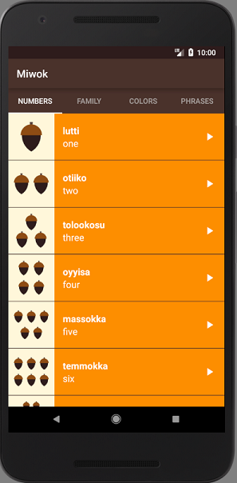
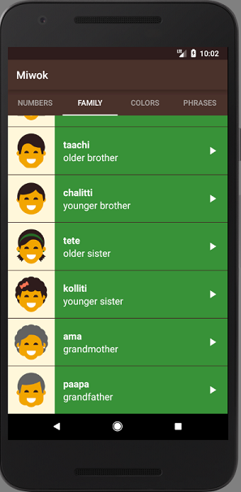
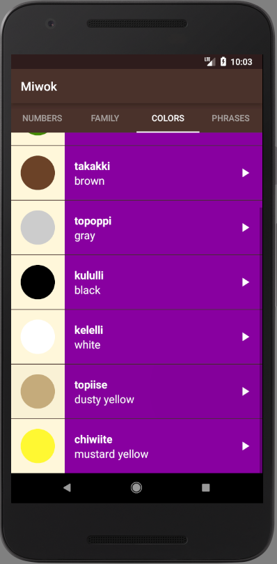

Miwok App
===================================

Appliaction that shows words translation from english to Indian Miwok Language - made as a part of the Google Udacity Android challenge. It's a multiscreen app with an ArrayList, ArrayAdapter and custom object's class. To build this app I also used the MediaPlayer API and AudioManager, so the user can hear the pronunciation of each word/statement. Activities were change into fragments to improve navigating through the appliaction.

If you want to see the app in action, please follow this link: https://tr0lczyk.tinytake.com/sf/MjI5ODYyOV83MDU0NDgy

The application looks like that:

